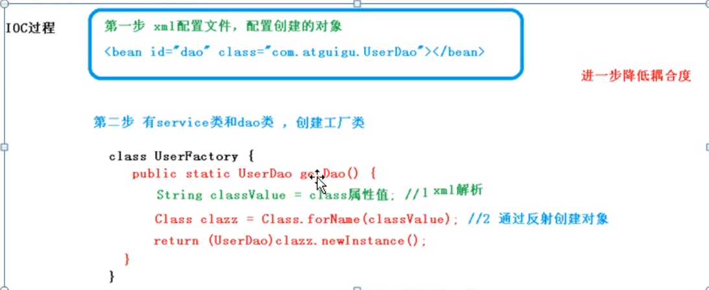

# srping5 新特性


[TOC]

基于Spring5

# 1.Spring概念

+ Spring是轻量级开源javaEE框架
+ 解决企业应用开发的复杂性
+ 核心:IOC、AOP
    + IOC:控制反转，将创建对象交给Spring管理
    + AOP：面向切面，不修改源代码进行功能增强
+ Spring特点
    + 方便解耦，简化开发
    + AOP支持
    + 方便测试 如Junit5
    + 集成其他框架
    + 方便进行事务操作
    + 降低APi开发难度

# 2.IOC容器

## IOC底层原理
**XML解析、工厂模式、反射
通过加载配置文件、获取类的全路径、反射类**


## IOC接口（BeanFactory）
+ IOC思想基于IOC容器完成,IOC容器底层就是对象工厂。
+ Spring提供IOC容器实现的2种方式:
    + BeanFactory：IOC容器基本实现，Spring内部使用接口
        + 加载配置文件时候**不会**创建对象，获取对象时后才会创建。
    + ApplicationContext：BeanFactory的子接口，提供更多强大的功能，一般是开发人员使用
        + 加载配置文件时候会创建对象。一般采用这种，将耗时放在启动时候

```java
ApplicationContext context = new ClassPathXmlApplicationContext("bean.xml");
BeanFactory beanFactory =  new ClassPathXmlApplicationContext("bean.xml");
```
+ ApplicationContext实现类
    + FileSystemXmlApplicationContext：系统文件 
    + ClassPathXmlApplicationContext:相对路径 src下
    
## IOC操作Bean

什么是Spring管理bean
+ Spring创建对象 IOC
+ Spring注入属性 DI

有XML和注解2种方式,随着Spring的发展，xml基本退出舞台，我们这里只看注解的方式
### 注解

组件注册、注入、赋值。详情可以见Spring注解驱动文章

https://blog.csdn.net/qiumeng_1314/article/details/107144536

# 3.AOP

1.什么是AOP
+ 面向切面编程
+ 不修改源代码 增强功能

## AOP底层原理

1.AOP底层使用动态代理
+ 接口：JDK 
**创建接口实现类代理对象，增强类的方法**
```java
public class InvocationHandlerImpl implements InvocationHandler {

    private Object object;

    public InvocationHandlerImpl(Object object) {
        this.object = object;
    }

    /**
     * 该方法负责集中处理动态代理类上的所有方法调用。
     * 调用处理器根据这三个参数进行预处理或分派到委托类实例上反射执行
     *
     * @param proxy  代理类实例
     * @param method 被调用的方法对象
     * @param args   调用参数
     * @return
     * @throws Throwable
     */
    public Object invoke(Object proxy, Method method, Object[] args) throws Throwable {
        //在代理真实对象前我们可以添加一些自己的操作
        System.out.println("在调用之前，我要干点啥呢？");

        System.out.println("Method:" + method);

        //当代理对象调用真实对象的方法时，其会自动的跳转到代理对象关联的handler对象的invoke方法来进行调用
        Object returnValue = method.invoke(object, args);

        //在代理真实对象后我们也可以添加一些自己的操作
        System.out.println("在调用之后，我要干点啥呢？");

        return returnValue;

    }

    public static void main(String[] args) {
        UserService userServiceImpl = new UserServiceImpl();
        InvocationHandlerImpl invocationHandler = new InvocationHandlerImpl(userServiceImpl);
        ClassLoader loader = userServiceImpl.getClass().getClassLoader();
        Class[] interfaces = userServiceImpl.getClass().getInterfaces();
        UserService userService = (UserService) Proxy.newProxyInstance(loader, interfaces, invocationHandler);
        userService.login();

    }
}
```
+ 没有接口:CGLB
**创建当前类子类的代理对象，增强类的方法**
```java
public class MyMethodInterceptor implements MethodInterceptor {
    @Override
    public Object intercept(Object obj, Method method, Object[] objects, MethodProxy methodProxy) throws Throwable {
        System.out.println("cglib before");
        Object result = methodProxy.invokeSuper(obj, objects);
        System.out.println("cglib after");
        return result;
    }

    public static void main(String[] args) {

        Enhancer enhancer = new Enhancer();
//设置父类
        enhancer.setSuperclass(Dog.class);
//设置方法拦截处理器
        enhancer.setCallback(new MyMethodInterceptor());
        //创建代理对象
        Dog dog = (Dog) enhancer.create();
        dog.eat();
    }
}
```
  
2.


# 4.JdbcTemplate

# 5.事务

# 6.Spring5新特性
